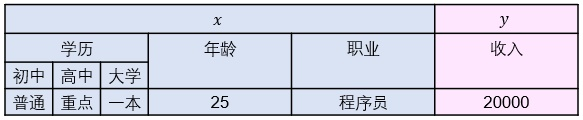

# TFRecord数据导入

{% embed data="{\"url\":\"https://zhuanlan.zhihu.com/p/33223782\",\"type\":\"link\",\"title\":\"YJango：TensorFlow中层API Datasets+TFRecord的数据导入\",\"description\":\"目录前言优势Dataset APITFRecord概念数据说明数据存储常用存储TFRecord存储实现生成数据写入TFRecord file存储类型如何存储张量feature使用Dataset创建dataset操作dataset解析函数迭代样本ShuffleBatchBatch padd…\",\"icon\":{\"type\":\"icon\",\"url\":\"https://static.zhihu.com/static/favicon.ico\",\"aspectRatio\":0},\"thumbnail\":{\"type\":\"thumbnail\",\"url\":\"https://pic3.zhimg.com/v2-f1ef00abf1a5245cbcb46b99c7517620\_r.jpg\",\"width\":1872,\"height\":820,\"aspectRatio\":0.43803418803418803}}" %}

## **优势**

### **一、为什么用Dataset API？**

**1. 简洁性**

* 常规方式：用python代码来进行batch，shuffle，padding等numpy类型的数据处理，再用placeholder + feed\_dict来将其导入到graph中变成tensor类型。因此在网络的训练过程中，不得不在tensorflow的代码中穿插python代码来实现控制。
* Dataset API：将数据直接放在graph中进行处理，整体对数据集进行上述数据操作，使代码更加简洁。

**2. 对接性**

TensorFlow中也加入了高级API （Estimator、Experiment，Dataset）帮助建立网络，和Keras等库不一样的是：这些API并不注重网络结构的搭建，而是将不同类型的操作分开，帮助周边操作。可以在保证网络结构控制权的基础上，节省工作量。若使用Dataset API导入数据，后续还可选择与Estimator对接。

### **二、为什么用TFRecord？**

在数据集较小时，我们会把数据全部加载到内存里方便快速导入，但当数据量超过内存大小时，就只能放在硬盘上来一点点读取，这时就不得不考虑数据的移动、读取、处理等速度。使用TFRecord就是为了提速和节约空间的。

## **概念**

在进行代码功能讲解之前，先明确一下想要存储和读取的数据是什么样子。

### **一、数据说明**

假设要学习判断个人收入的模型。我们会事先搜集反映个人信息的输入  ，用这些信息作为判断个人收入的依据。同时也会把拥有  的人的实际收入  也搜集。这样搜集  个人的 后形成我们的数据集  。

#### **1. 训练：**

在每一步训练中，神经网络会把输入 和 正确的输出 送入 中来更新一次神经网络  中的参数  。用很多个不同的  不断更新  ，最终希望当遇到新的 时，可以用  判断出正确的  。

#### **2. 专有名词：**

结合下图说明名称

样本 \(example\)：  ：输入 和 正确的输出一起叫做样本。给网络展示了什么输入该产生什么样的输出。这里每个是五维向量，每个是一维向量。

* 表征 \(representation\)： ：集合了代表个人的全部特征。
  * 特征 \(feature\)：  中的某个维：如年龄，职业。是某人的一个特点。
* 标签 \(label\)：：正确的输出。

### **二、数据存储**

为达成上述的训练，我们需要把所有的样本存储成合适的类型以供随后的训练。

#### **1. 常用存储：**

输入 和 标签是分开存储，若有100个样本，所有的输入存储成一个  的numpy矩阵；所有的输出则是  。

#### **2. TFRecord存储：**

TFRecord是以字典的方式一次写一个样本，字典的keys可以不以输入和标签，而以不同的特征（如学历，年龄，职业，收入）区分，在随后的读取中再选择哪些特征形成输入，哪些形成标签。这样的好处是，后续可以根据需要只挑选特定的特征；也可以方便应对例如多任务学习这样有多个输入和标签的机器学习任务。

 注：一般而言，单数的feature是一个维度，即标量。所有的features组成representation。但在 TFRecord的存储中，字典中feature的value可以不是标量。如：key为学历的value就可以是：\[初中，高中，大学\]，3个features所形成的向量。亦可是任何维度的张量。

